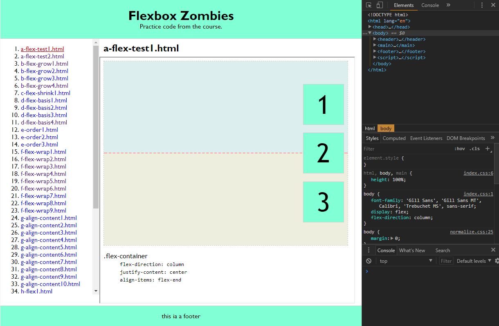
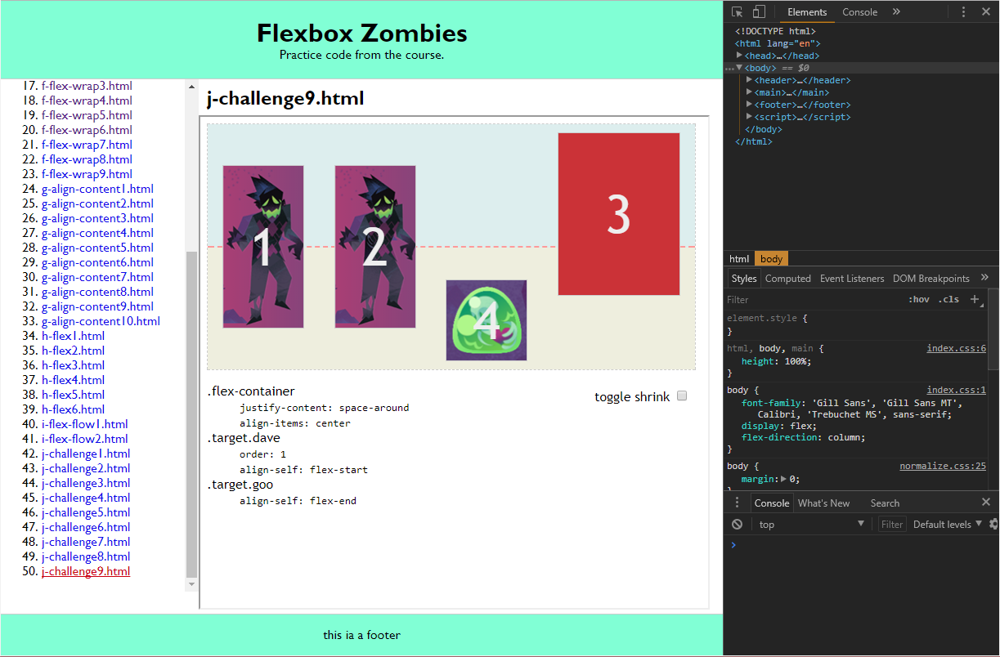

# Flexbox Zombies

[https://james-priest.github.io/flexbox-zombie-code/](https://james-priest.github.io/flexbox-zombie-code/)

This is sample code I wrote when following along with the [Flexbox Zombies](https://flexboxzombies.com) learning game.

I created a TOC menu on the left for easy navigation and used an iframe on the right to display the sample code.

Where necessary I added a shrink/expand toggle which animates the flex container. This shows how flex items shift based on property settings and container size.

